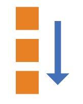
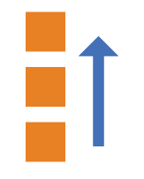

## flex 布局

### 一、flex 布局是什么

* flex是Flexible Box的缩写，意为"弹性布局"，用来为盒状模型提供最大的灵活性
* 任何一个容器都可以指定为 Flex 布局
* 注意：设置为flex布局后，子元素的float、clear、vertical-align属性将会失效

~~~
// 块级元素
.box {
  display: flex;
}
// 行内元素
.box {
  display: inline-flex;
}
~~~

### 二、基本概念

* 采用flex布局的元素，称为flex容器（flex container）
* 它的所有直接子元素自动成为flex容器成员，称为flex项目（flex item）

* 容器默认存在两根轴：水平的主轴（main axis）和垂直的交叉轴（cross axis），项目默认沿主轴排列
* 主轴的开始位置（与边框的交叉点）叫做main start，结束位置叫做main end；交叉轴的开始位置叫做cross start，结束位置叫做cross end
* 单个项目占据的主轴空间叫做main size，占据的交叉轴空间叫做cross size。

### 三、flex 容器的属性

* flex容器上有6个属性
  ~~~
  // 决定主轴的方向（即flex项目的排列方向）
  flex-direction 
  // 定义一条轴向如果排不下，如何换行
  flex-wrap
  // flex-direction属性和flex-wrap属性的简写方式
  flex-flow
  // 定义flex项目在主轴上的对齐方式
  justify-content
  // 定义flex项目在交叉轴上的对齐方式
  align-items
  // 定义多根轴线的对齐方式
  align-content
  ~~~
  
  #### 3.1 flex-direction 属性

  * 决定主轴的方向（即flex项目的排列方向）
  * 它可能取4个值（flex-direction: row | row-reverse | column | column-reverse）

    ~~~
    row（默认值）：主轴为水平方向，起点在左端
    row-reverse：主轴为水平方向，起点在右端
    column：主轴为垂直方向，起点在上沿
    column-reverse：主轴为垂直方向，起点在下沿
    ~~~

    
    
    
    
  
  #### 3.2 flex-wrap 属性

  * 定义一条轴向如果排不下，如何换行
  * 它可能取3个值（flex-wrap: nowrap | wrap | wrap-reverse;）

    ~~~
    nowrap（默认值）：不换行
    wrap：换行，第一行在上方
    wrap-reverse：换行，第一行在下方
    ~~~
    1. nowrap：不换行
    

    1. wrap：换行，第一行在上方
    

    1. wrap-reverse：换行，第一行在下方
    

  #### 3.3 flex-flow 属性

  * flex-direction属性和flex-wrap属性的简写方式,默认值为 row nowrap
  * flex-flow: \<flex-direction> || \<flex-wrap>

  #### 3.4 justify-content 属性

  * 定义flex项目在主轴上的对齐方式
  * 它可能取5个值（justify-content: flex-start | flex-end | center | space-between | space-around;）

    ~~~
    flex-start（默认值）：左对齐
    flex-end：右对齐
    center： 居中
    space-between：两端对齐，项目之间的间隔都相等
    space-around：每个项目两侧的间隔相等。所以，项目之间的间隔比项目与边框的间隔大一倍
    ~~~
    

  #### 3.5 align-items 属性

  * 定义flex项目在交叉轴上的对齐方式
  * 它可能取5个值（align-items: flex-start | flex-end | center | baseline | stretch;）

    ~~~
    flex-start：交叉轴的起点对齐
    flex-end：交叉轴的终点对齐
    center：交叉轴的中点对齐
    baseline: 项目的第一行文字的基线对齐
    stretch（默认值）：如果项目未设置高度或设为auto，将占满整个容器的高度。
    ~~~
    

  #### 3.6 align-content 属性

  * 定义多根轴线的对齐方式，如果项目只有一根轴线，该属性不起作用
  * 它可能取6个值（align-content: flex-start | flex-end | center | space-between | space-around | stretch;）

    ~~~
    flex-start：与交叉轴的起点对齐
    flex-end：与交叉轴的终点对齐
    center：与交叉轴的中点对齐
    space-between：与交叉轴两端对齐，轴线之间的间隔平均分布。
    space-around：每根轴线两侧的间隔都相等。所以，轴线之间的间隔比轴线与边框的间隔大一倍
    stretch（默认值）：轴线占满整个交叉轴
    ~~~
    

### 四、flex 项目的属性

* flex项目的属性上有6个属性
  ~~~
  // 定义项目的排列顺序。数值越小，排列越靠前，默认为0
  order
  // 定义项目的放大比例，默认为0，即如果存在剩余空间，也不放大
  flex-grow
  // 定义了项目的缩小比例，默认为1，即如果空间不足，该项目将缩小
  flex-shrink
  // 定义了在分配多余空间之前，项目占据的主轴空间（main size）
  flex-basis
  // flex-grow属性、flex-shrink属性、flex-basis属性的简写
  flex
  // 允许单个项目有与其他项目不一样的对齐方式
  align-self
  ~~~
  
  #### 4.1 order 属性
  * 定义项目的排列顺序。数值越小，排列越靠前，默认为0
  * order:\<integer>;
  

  #### 4.2 flex-grow 属性
  * 定义项目的放大比例，默认为0，即如果存在剩余空间，也不放大
  * flex-grow: \<number>;
  * 如果所有项目的flex-grow属性都为1，则它们将等分剩余空间（如果有的话）
  * 如果一个项目的flex-grow属性为2，其他项目都为1，则前者占据的剩余空间将比其他项多一倍
  

  #### 4.3 flex-shrink 属性
  * 定义了项目的缩小比例，默认为1，即如果空间不足，该项目将缩小
  * flex-shrink: \<number>;
  * 如果所有项目的flex-shrink属性都为1，当空间不足时，都将等比例缩小
  * 如果一个项目的flex-shrink属性为0，其他项目都为1，则空间不足时，前者不缩小
  * 负值对该属性无效
  
    

  #### 4.4 flex-basis 属性
  * 定义了在分配多余空间之前，项目占据的主轴空间（main size）
  * 浏览器根据这个属性，计算主轴是否有多余空间。它的默认值为auto，即项目的本来大小
  * 它可以设为跟width或height属性一样的值（比如500px），则项目将占据固定空间
  * flex-basis: \<length> | auto;

  #### 4.5 flex 属性
  * flex-grow属性、flex-shrink属性、flex-basis属性的简写
  * flex: none | [ <'flex-grow'> <'flex-shrink'>? || <'flex-basis'> ]
  * 建议优先使用这个属性，而不是单独写三个分离的属性，因为浏览器会推算相关值

  #### 4.6 align-self 属性
  * 允许单个项目有与其他项目不一样的对齐方式，可覆盖align-items属性。默认值为auto，表示继承父元素的align-items属性，如果没有父元素，则等同于stretch
  * 它可能取6个值（align-self: auto | flex-start | flex-end | center | baseline | stretch;）
  * 除了auto，其他都与align-items属性完全一致
  