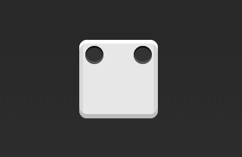
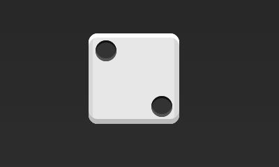
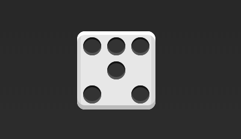

## flex 布局实例篇

### 前言
* 骰子的一面，最多可以放置9个点
  
  

* 下面就来看看flex是如何实现，从1个点到9个点的布局
  
  

* div元素（代表骰子的一个面）是Flex容器，span元素（代表一个点）是Flex项目。如果有多个项目，就要添加多个span元素，以此类推
  ~~~
  

    
  

  ~~~

### 一、单项目

* 首先，只有左上角1个点的情况。Flex布局默认就是首行左对齐，所以一行代码就够了
  
  
  ~~~
  .box {
    display: flex;
  }
  ~~~

* 设置项目的对齐方式，就能实现居中对齐和右对齐
  
  
  ~~~
  .box {
    display: flex;
    justify-content: center;
  }
  ~~~

  
  ~~~
  .box {
    display: flex;
    justify-content: flex-end;
  }
  ~~~

* 设置交叉轴对齐方式，可以垂直移动主轴
  
  
  ~~~
  .box {
    display: flex;
    align-items: center;
  }
  ~~~

  
  ~~~
  .box {
    display: flex;
    justify-content: center;
    align-items: center;
  }
  ~~~

  
  ~~~
  .box {
    display: flex;
    justify-content: center;
    align-items: flex-end
  }
  ~~~

  
  ~~~
  .box {
    display: flex;
    justify-content: flex-end;
    align-items: flex-end;
  }
  ~~~

### 二、双项目
  
  
  ~~~
  .box {
    display: flex;
    justify-content: space-between;
  }
  ~~~

  
  ~~~
  .box {
    display: flex;
    flex-direction: column;
    justify-content: space-between;
  }
  ~~~

  
  ~~~
  .box {
    display: flex;
    flex-direction: column;
    justify-content: space-between;
    align-items: center;
  }
  ~~~

  
  ~~~
  .box {
    display: flex;
    flex-direction: column;
    justify-content: space-between;
    align-items: flex-end;
  }
  ~~~

  
  ~~~
  .box {
    display: flex;
  }

  .item:nth-child(2) {
    align-self: center;
  }
  ~~~

  
  ~~~
  .box {
    display: flex;
    justify-content: space-between;
  }

  .item:nth-child(2) {
    align-self: flex-end;
  }
  ~~~

### 三、三项目

  
  ~~~
  .box {
    display: flex;
  }

  .item:nth-child(2) {
    align-self: center;
  }

  .item:nth-child(3) {
    align-self: flex-end;
  }
  ~~~

### 四、四项目

  
  ~~~
  .box {
    display: flex;
    flex-wrap: wrap;
    justify-content: flex-end;
    align-content: space-between;
  }
  ~~~

  
  ~~~
  // HTML
  

    

      
      
    

    

      
      
    

  

  // CSS
  .box {
    display: flex;
    flex-wrap: wrap;
    align-content: space-between;
  }

  .column {
    flex-basis: 100%;
    display: flex;
    justify-content: space-between;
  }
  ~~~

### 五、六项目

  
  ~~~
  .box {
    display: flex;
    flex-wrap: wrap;
    align-content: space-between;
  }
  ~~~

  
  ~~~
  .box {
    display: flex;
    flex-direction: column;
    flex-wrap: wrap;
    align-content: space-between;
  }
  ~~~

  
  ~~~
  // HTML
  

    

      
      
      
    

    

      
    

    

      
      
    

  

  // CSS
  .box {
    display: flex;
    flex-wrap: wrap;
  }

  .row{
    flex-basis: 100%;
    display:flex;
  }

  .row:nth-child(2){
    justify-content: center;
  }

  .row:nth-child(3){
    justify-content: space-between;
  }
  ~~~

### 六、九项目

  
  ~~~
  .box {
    display: flex;
    flex-wrap: wrap;
  }
  ~~~