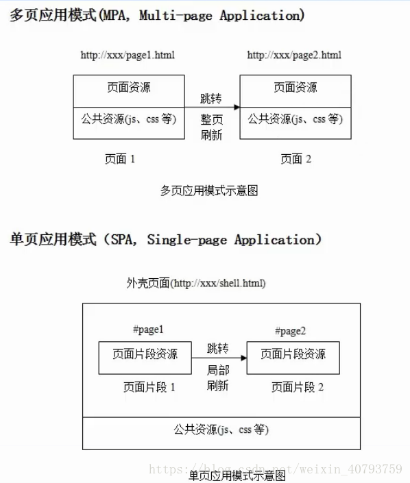
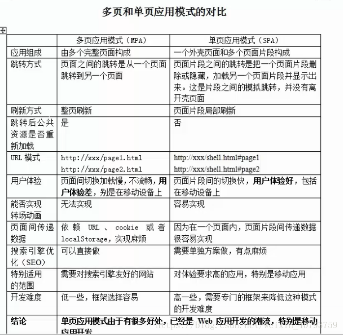

## 单页面和多页面的区别

### 一、单页面与多页面的区别

#### 多页面应用模式（MPA，Multi-page Application）

#### 单页面应用模式（SPA，Single-page Application）

### 二、单页面与多页面的对比

<table>
  <tr>
    <td></td>
    <td>多页面模式（MPA）</td>
    <td>单页面模式（SPA）</td>
  </tr>
  <tr>
    <td>应用组成</td>
    <td>由多个完整页面构成</td>
    <td>一个外壳页面和多个页面片段构成</td>
  </tr>
  <tr>
    <td>跳转方式</td>
    <td>页面之间的跳转是从一个页面跳转到另外一个页面</td>
    <td>
      页面片段之间的跳转是把一个页面片段删除或者隐藏，加载另一个页面片段并显示出来。
       
      这是片段之间的模拟跳转，并没有离开壳页面
    </td>
  </tr>
  <tr>
    <td>刷新方式</td>
    <td>整夜刷新</td>
    <td>页面片段局部刷新</td>
  </tr>
  <tr>
    <td>跳转后公共资源是否重新加载</td>
    <td>是</td>
    <td>否</td>
  </tr>
  <tr>
    <td>URL模式</td>
    <td>http://xxx/page1.html   http://xxx/page1.html</td>
    <td>http://xxx/page.html#page1   http://xxx/page.html#page2</td>
  </tr>
  <tr>
    <td>用户体验</td>
    <td>页面间切换加载慢，不流畅，用户体验差，特别是在移动设备上</td>
    <td>页面片段间的切换快，用户体验好，包括在移动设备上</td>
  </tr>
  <tr>
    <td>能否实现转成动画</td>
    <td>无法实现</td>
    <td>容易实现</td>
  </tr>
  <tr>
    <td>页面间传递数据</td>
    <td>依赖URL、cookie或者localStore,实现麻烦</td>
    <td>因为在一个页面内，页面片段传递数据很容易实现</td>
  </tr>
  <tr>
    <td>搜索引擎优化（SEO）</td>
    <td>可以直接做</td>
    <td>需要单独方案做，有点麻烦</td>
  </tr>
  <tr>
    <td>特别适用的范围</td>
    <td>需要对搜索引擎友好的网站</td>
    <td>对用户体验要求高的应用，特别是移动端</td>
  </tr>
  <tr>
    <td>开发难度</td>
    <td>低一些，框架容易选择</td>
    <td>高一些，需要专门的框架来降低这种模式的开发难度</td>
  </tr>
  <tr>
    <td>结论</td>
    <td colspan="2">单页面应用模式由于有很多好处，已经是web应用开发的潮流，特别是移动应用开发</td>
  </tr>
</table>